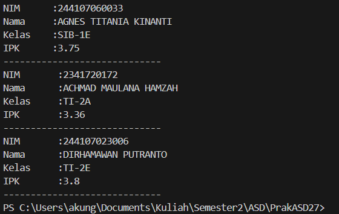

|  | Algoritma dan Struktur Data |
|--|--|
| NIM |  254107020238|
| Nama |  Rifat Marciano Putera |
| Kelas | TI - 1F |
| Repository | [link] https://github.com/vyoups/PrakASD27

# Jobsheet 3 Array Of Object

## Hasil Running Praktikum ke-1
Hasilnya menunjukan program dapat dijalankan

## Pertanyaan praktikum ke-1
1. Tidak harus. Sebuah class yang akan dijadikan array of object tidak wajib memiliki keduanya sekaligus. Class `Mahasiswa` pada praktikum ini hanya memiliki atribut (nim, nama, kelas, ipk) tanpa method, dan tetap bisa dibuat array of object-nya. Yang terpenting, class tersebut merupakan tipe data yang valid di Java.

---

2. Kode tersebut mendeklarasikan sekaligus membuat sebuah **array bertipe Mahasiswa** dengan nama `arrayOfMahasiswa` yang berkapasitas **3 elemen**. Namun pada tahap ini, setiap elemen array masih bernilai `null` karena objek Mahasiswa di tiap indeks belum diinstansiasi.

---

3. Class `Mahasiswa` **tidak memiliki konstruktor yang ditulis secara eksplisit**. Namun, di Java setiap class yang tidak mendefinisikan konstruktor secara otomatis mendapatkan **default constructor** (konstruktor tanpa parameter) yang disediakan oleh compiler Java. Itulah mengapa pemanggilan `new Mahasiswa()` tetap bisa dilakukan.

---

4.  Membuat objek `Mahasiswa` baru dan menyimpannya di indeks ke-0 array, Mengisi atribut `nim`, `nama`, `kelas`, dan `ipk` dari objek pada indeks ke-0 tersebut dengan nilai yang ditentukan.

---

5. Karena menerapkan prinsip **Separation of Concerns** dalam OOP:
- Class `Mahasiswa` berperan sebagai **model/blueprint** yang mendefinisikan struktur data (atribut dan method).
- Class `MahasiswaDemo` berperan sebagai **class driver/main** yang menjalankan program dan menggunakan objek Mahasiswa.

Pemisahan ini membuat kode lebih **terorganisir, mudah dipelihara, dan dapat digunakan ulang (reusable)** di class lain tanpa harus mengubah class Mahasiswa.

---

