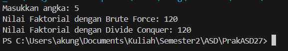
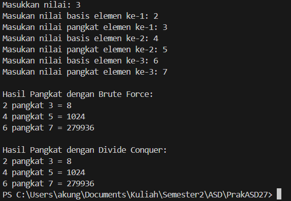
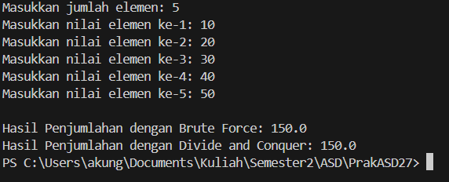
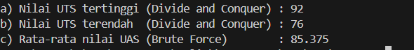

|  | Algoritma dan Struktur Data |
|--|--|
| NIM |  254107020238|
| Nama |  Rifat Marciano Putera |
| Kelas | TI - 1F |
| Repository | [link] https://github.com/vyoups/PrakASD27

# Jobsheet 5 BRUTE FORCE DAN DIVIDE CONQUER

## Hasil running praktikum ke-1
Hasil menunjukan program dapat dijalankan dengan normal



## Pertanyaan praktikum ke-1
1. Perbedaan bagian **if** dan **else** pada algoritma Divide and Conquer faktorial:
**if (n==1)**  Ini adalah base case (kondisi berhenti). Ketika n sudah mencapai 1, langsung kembalikan nilai 1 tanpa rekursi lagi. Ini mencegah rekursi berjalan tanpa batas.
- **else**  Ini adalah recursive case. Ketika n masih lebih dari 1, masalah dipecah menjadi submasalah yang lebih kecil dengan memanggil **faktorialDC(n-1)**, lalu hasilnya dikalikan dengan n.

---

2. Bisa, perulangan **for** dapat diganti dengan **while**:
```java
//perulangan for
int faktorialBF(int n){
    int fakto = 1;
    int i = 1;
    while(i <= n){
        fakto = fakto * i;
        i++;
    }
    return fakto;
}

//perulangan while
int faktorialBF(int n){
    int fakto = 1;
    int i = 1;
    do {
        fakto = fakto * i;
        i++;
    } while(i <= n);
    return fakto;
}
```
---

3. **fakto *= i;** = Biasanya digunakan dalam perulangan (misalnya for atau while) untuk menghitung faktorial secara iteratif.
Nilai variabel yang sama diperbarui terus-menerus setiap kali perulangan berjalan.

- **int fakto = n * faktorialDC(n-1);** = Variabel fakto diisi dengan hasil perkalian antara n dan pemanggilan fungsi faktorialDC dengan parameter n-1.

---

4. **pangkatBF()**, bekerja secara linear dan iteratif. Untuk menghitung aⁿ, loop berjalan tepat n kali dengan terus mengalikan hasilnya dengan a. Semakin besar pangkat, semakin banyak iterasi yang dibutuhkan.

- **pangkatDC()**, bekerja secara rekursif dengan strategi bagi dua (divide). Eksponen dibagi dua setiap langkahnya, sehingga jumlah pemanggilan rekursif jauh lebih sedikit. Ini membuat pangkatDC() lebih unggul untuk nilai pangkat yang besar karena kompleksitasnya O(log n) dibanding O(n) milik pangkatBF().

---

## Hasil running praktikum ke-2
Hasil menunjukan program dapat dirunning



## Pertanyaan praktikum ke-2
1. **PangkatBF()** = Menggunakan iterasi. Menghitung aⁿ dengan cara mengalikan a sebanyak n kali dalam loop for. Prosesnya linier O(n), sederhana dan mudah dipahami.

- **PangkatDC()** = Menggunakan rekursi dengan pembagian eksponen. Memanfaatkan sifat matematika: jika n genap maka aⁿ = (aⁿ/²)², jika n ganjil maka aⁿ = (aⁿ/²)² × a. Prosesnya logaritmik O(log n), lebih efisien untuk pangkat besar.

---

2. Ya, tahap combine sudah ada. Pada pangkatDC(), tahap combine terjadi ketika hasil rekursi digabungkan kembali melalui perkalian:

```java
// Combine untuk n ganjil:
return (pangkatDC(a, n/2) * pangkatDC(a, n/2) * a);

// Combine untuk n genap:
return (pangkatDC(a, n/2) * pangkatDC(a, n/2));
```

---

3. Tetap relevan memiliki parameter karena metode ini bersifat umum dan bisa dipanggil dengan nilai sembarang, tidak tergantung pada atribut objek tertentu.Bisa dibuat tanpa parameter, dengan memanfaatkan atribut nilai dan pangkat yang sudah ada di class

---

4. **PangkatBF()** =  bekerja secara linear dan iteratif. Untuk menghitung aⁿ, loop berjalan tepat n kali dengan terus mengalikan hasilnya dengan a. Semakin besar pangkat, semakin banyak iterasi yang dibutuhkan.

- **PangkatDC()** = bekerja secara rekursif dengan strategi bagi dua (divide). Eksponen dibagi dua setiap langkahnya, sehingga jumlah pemanggilan rekursif jauh lebih sedikit. Ini membuat pangkatDC() lebih unggul untuk nilai pangkat yang besar karena kompleksitasnya O(log n) dibanding O(n) milik pangkatBF().


## Hasil running praktikum ke-3
Hasil menunjukan program dapat dijalankan



## Pertanyaan praktikum ke-3
1. Variabel mid dibutuhkan untuk membagi array menjadi dua bagian yang seimbang. mid = (l+r)/2 menentukan titik tengah array sehingga subarray kiri mencakup indeks l hingga mid, dan subarray kanan mencakup mid+1 hingga r. Tanpa mid, proses divide tidak bisa dilakukan.

---

2. Kedua statement itu adalah tahap Conquer, yaitu menyelesaikan submasalah secara rekursif. lsum menjumlahkan semua elemen di separuh kiri array, sedangkan rsum menjumlahkan semua elemen di separuh kanan array. Masing-masing terus dibagi lagi hingga mencapai base case.

---

3. return lsum+rsum adalah tahap Combine, yaitu menggabungkan hasil dari dua submasalah (kiri dan kanan) menjadi satu solusi utuh. Setelah kedua bagian selesai dijumlahkan secara rekursif, hasilnya digabungkan dengan penjumlahan biasa untuk mendapatkan total keseluruhan array.

---

4. Base case-nya adalah ketika indeks kiri sama dengan indeks kanan (l == r), artinya array sudah tidak bisa dibagi lagi dan hanya tersisa satu elemen. Pada kondisi ini, elemen tunggal tersebut langsung dikembalikan sebagai hasilnya.


---

5. **totalDC()** Bekerja dengan tiga tahap Divide and Conquer:
- Divide: Array dibagi dua menggunakan titik tengah mid = (l+r)/2
- Conquer: Masing-masing subarray kiri dan kanan dijumlahkan secara rekursif hingga mencapai base case (satu elemen)
- Combine: Hasil penjumlahan kiri (lsum) dan kanan (rsum) digabungkan dengan return lsum+rsum

Proses ini terus berulang secara rekursif sehingga seluruh elemen array berhasil dijumlahkan. Kompleksitasnya O(n) sama dengan Brute Force, namun totalDC() menunjukkan konsep Divide and Conquer secara eksplisit dengan pemisahan masalah yang jelas.

## Hasil running tugas

