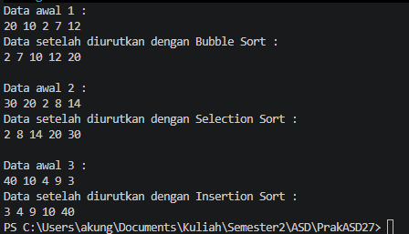
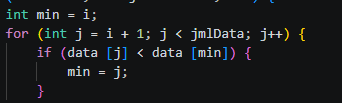
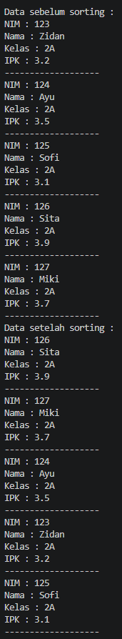

|  | Algoritma dan Struktur Data |
|--|--|
| NIM |  254107020238|
| Nama |  Rifat Marciano Putera |
| Kelas | TI - 1F |
| Repository | [link] https://github.com/vyoups/PrakASD27

# Jobsheet 6 Sorting

## Hasil Running Praktikum ke-1
Hasilnya menunjukan program dapat dijalankan

## Jawaban dari pertanyaan praktikum ke-1
1. Memeriksa apakah elemen sebelumnya lebih besar dari elemen sesudahnya; jika ya, kedua elemen ditukar (swap) menggunakan variabel temp. Ini adalah inti dari bubble sort.

---

2. 

---

3. Terus geser elemen ke kanan selama indeks j masih valid (≥0) DAN elemen di posisi j masih lebih besar dari elemen yang sedang disisipkan.

---

4. Bertujuan menggeser elemen satu posisi ke kanan untuk membuat "ruang kosong" tempat elemen yang sedang disisipkan akan ditempatkan.

---

## Hasil Running Praktikum ke-2
Hasilnya menunjukan program dapat dijalankan

## Jawaban dari pertanyaan praktikum ke-2
1 A. Karena pada setiap tahap bubble sort, elemen terbesar sudah "menggelembung" ke posisi akhir, sehingga iterasi terakhir tidak perlu dilakukan.

1 B. Karena setelah i tahap, sudah ada i elemen yang sudah berada di posisi akhir yang benar, jadi tidak perlu dibandingkan lagi.

1 C. Jika data 50 elemen, perulangan i berlangsung 49 kali (50-1), dan ada 49 tahap bubble sort.

---

2. Untuk descending, ubah kondisi while menjadi: while (j > 0 && listMhs[j-1].ipk < temp.ipk) (ganti > menjadi <).