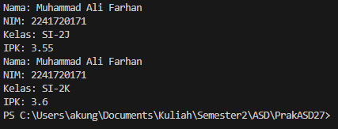
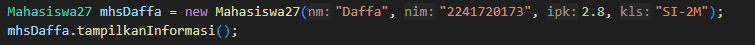

|  | Algoritma dan Struktur Data |
|--|--|
| NIM |  254107020238|
| Nama |  Rifat Marciano Putera |
| Kelas | TI - 1F |
| Repository | [link] https://github.com/vyoups/PrakASD27   

# Jobsheet 2 Object

## 2.1.1 Hasil Running
Hasilnya menunjukan bahwa program tsb tidak dpt dirun karena tidak aja main classnya

### 2.1.2 Pertanyaan
- I.  dua karakteristik class atau object adalah atribut dan method/fungsi
- II. pada class Mahasiswa memiliki 4 atribut yaitu String nama; String nim; String kelas; double ipk;
- III. ada 4 method, yaitu tampilkanInformasi(): void; ubahKelas(kelasBaru: String): void; updateIpk(ipkBaru: double): void; nilaiKinerja(ipk: double): String
Modifikasi kode program
- IV. Update Kode:

- V.  method nilaiKinerja() bekerja dengan cara mengecek kondisi nilai IPK (>= 3.5 kinerja sangat baik, >=3.0 kinerja baik, >=2.0 kinerja cukup, dan <2.0 kinerja kurang).      Method nilaiKinerja() mengembalikan nilai bertipe String berupa kategori kinerja mahasiswa.

## 2.2.1. Hasil Running
Hasilnya program dapat dijalankan

### 2.2.2 Pertanyaan
- I.   Baris ke-5
- II.  Menggunakan dot notation (titik), yaitu namaObjek.atribut atau namaObjek.method().
- III. Karena sebelum pemanggilan tampilkanInformasi() yang kedua, ada dua method yang mengubah nilai atribut objek mhs1:

## 2.3.1 Hasil Running
Hasil program dapat dijalankan

### 2.3.2 
- I.   Baris Ke-9
- II.  Memberikan nilai pada variable yang sudah disediakan  
- III. program tidak dapat dijalankan karena objek dibuat tanpa parameter, sementara konstruktor tanpa parameter sudah dihapus
- IV.  Update Kode: 

## 2.4.1 Hasil Running TUGAS 1

## 2.5.1 Hasil Running TUGAS 2
